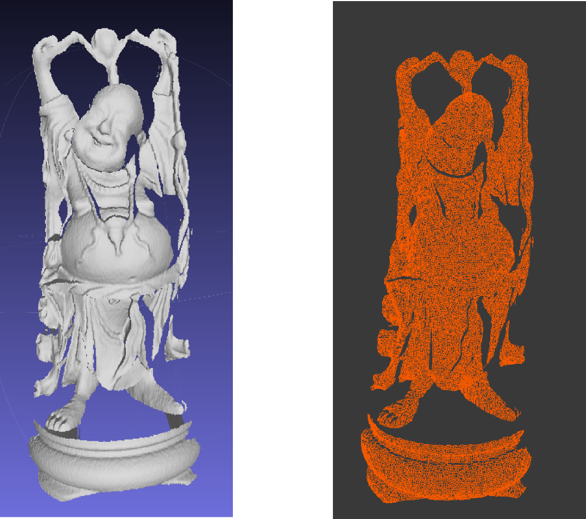
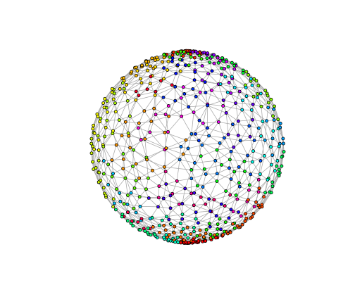
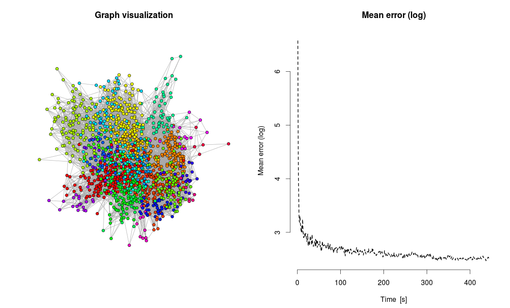

## Projekt


* Początek w styczniu 2014

* 12 studentów, 3 podprojekty

* ~300 commitów - koniec maja

* [github.com/gmum/gmum.r](github.com/gmum/gmum.r)

<div style='text-align: center;'>
    
</div>

--- .class #id 

## People

Don Corleone: mgr. Wojciech Czarnecki

* **Growing Neural Gas**: Stanisław Jastrzębski, opiekun dr hab. Igor Podolak

* **SVM**: Piotr Kowenzowski (lider), opiekun mgr. Wojciech Czarnecki
 
  * SVM - wrapper : Igor Sieradzki (lider),  Konrad Talik, Piotr Skoczylas

  * 2eSVM : Kamil Kuś (lider), Agnieszka Pocha, Mateusz Bruno-Kamiński
  
* **Cross Entropy Clustering**: Michał Pletty (lider), Michał Zgliczyński, Marcin Data, opiekun mgr. Przemysław Spurek

--- .class #id 

## Cele

* Wydajnosc (C++/Rcpp)

* Big datasets

* Przejrzystość

* Implementacja algorytmów stworzonych w grupie GMUM

--- .class #id

## Growing Neural Gas - timeline

* Początek w 2012

* Publikacja: Density Invariant Detection of Osteoporosis Using Growing Neural Gas :)

* Refaktoring/przepisywanie semestr letni 2014

<div style='text-align: center;'>
    
</div>

--- .outfont_medium #id

## Growing Neural Gas - worth noting

* Online - (probably) the only package supporting online clustering w R

* Big datasets

* Efficient C++ implementation (improvements suggested in Fiser publication 2012)

* Deep integration with igraph package, dumping to file


<div style='text-align: center;'>
    
</div>

--- .codefont .outfont .codemargin .outmargin .nobackground 

## Growing Neural Gas - simplest demo

Simplest demo - cluster sphere dataset without any optimization


```r
library('GrowingNeuralGas')
# Construct gng object
gng <- GNG(dataset_type=gng.dataset.sequential, 
           max_nodes=600, dim=3)

# Construct examples, here we will use a sphere
insert_examples(gng, preset=gng.preset.sphere, N=10000)

# Run and wait
run(gng)
Sys.sleep(5)

# Dump model
dump_model(gng, "temp.gng.bin")

# Print number of nodes
number_nodes(gng)
```

```
## [1] 600
```

```r
# Terminate
terminate(gng)
```

--- .codefont .outfont .codemargin .outmargin .nobackground 

## Growing Neural Gas - simplest demo


```r
# Plot loaded gng
gng <- GNG(dataset_type=gng.dataset.sequential, max_nodes=600, 
           dim=3, load_model_filename='temp.gng.bin')

plot(gng, vertex.color=gng.plot.color.cluster, mode=gng.plot.2d)
```

```
## [1] TRUE
```



--- .outfont_medium

## Growing Neural Gas - functions - constructor

  *  **beta** - Decrease the error variables of all node nodes by this fraction. Forgetting rate. Default 0.99

  *  alpha - Alpha coefficient. Decrease the error variables of the nodes neighboring to the newly inserted node by this fraction. Default 0.5

  *  uniformgrid_optimization - TRUE/FALSE. If TRUE please pass bounding box
     parameters also.

  *  lazyheap_optimization - TRUE/FALSE. 

  *  max.node - Maximum number of nodes (after reaching this size it will continue running, but won't add new nodes)

  *  eps_n - Default 0.05

  *  eps_v - Default 0.0006

  *  dataset_type - Dataset type. Possibilities gng.dataset.bagging, gng.dataset.bagging.prob (sampling according to dim+1 coordinate probability), gng.dataset.sequential (loop through examples - default option)

  *  experimental_utility_option - EXPERIMENTAL Utility option (try using it
     for quickly changing distributions). Value: gng.experimental.utility.option.off / gng.experimental.utility.option.basic

  *  experimental_vertex_extra_data

  *  load_model_filename - Set to path to file from which load serialized model

  *  max_edge_age - Maximum age of edge, after which it is deleted. Decrease
     if your graph is not following changes of the dataset (you can also try
     experimental utility option)


--- .outfont_medium

## Growing Neural Gas - functions

* **run(gng)**, pause(gng), terminate(gng) - execution control

* node(gng, gng_index) - returns node given index

* dump_model(gng, filename) - dump model to file

* mean_error(gng) - mean error in the graph

* number_nodes(gng) - returns number of nodes

* error_statistics(gng) - vector of errors every second

* plot(gng, mode, layout, vertex.color start_s) - plots gng using one of the presets (gng.plot.rgl3d,
  gng.plot.2d, gng.plot.2derrors). If plotting erros you can specify second from
  it will plot the errors. 

--- .outfont_medium

## Growing Neural Gas - functions

* centroids(gng) - using igraph algorithm GNG will write centroids of found
  clusters (community centers)

* convert_igraph(gng) - converts GNG to igraph

* predict(gng, x) - return gng_index of the closest node in the graph to given
  example

* insert_examples(gng, M) - inefficient adding examples to the graph

* gng$insert_examples() - add examples to gng object. **Note**: this will
  perform a copy to gng object dataset. To set memory pointer to your matrix use
  set_memory_move_examples function (you cannot change it to other memory
pointer later on, only add new examples). You can also use function
insert_examples(gng, ...), but this will perform 2 copies in RAM due to R design.


--- .codefont .outfont .codemargin .outmargin .nobackground 

## Growing Neural Gas - MNIST demo

Cluster MNIST digit dataset


```r
gng <- GNG(dataset_type=gng.dataset.bagging, max_nodes=1500, dim=784, 
lazyheap_optimization=TRUE, experimental_vertex_extra_data=TRUE, 

load_model_filename="mnist.trained.1500.bin")

data_train <- read.csv('mnist-train.csv')
data_test <- read.csv('mnist-test.csv')

gng$set_memory_move_examples(data_train)

plot(gng, mode=gng.plot.2d.errors, 
     vertex.color=gng.plot.color.extra, layout=gng.plot.layout.igraph.fruchterman.fast)


### Test prediction of 0 ###
for(i in 1:nrow(data$test)){
  if(data$test[i, 785]==0){
    predict(gng, data$test[i,-1])
    node(gng, predict(gng, data$test[i,-1]))
    print(node(gng, predict(gng, data$test[i,-1]))$extra_data)
  }
}
```

---

### Growing Neural Gas - MNIST demo


<div style='text-align: center;'>
    
</div>

--- .codefont .outfont .codemargin .outmargin .nobackground 

### Growing Neural Gas - MNIST demo

Plot centroids


```r
### Find centroids using infomap community detection from igraph package ###
centr <- centroids(gng)
### Plot centroids ###
centroids_pos = lapply(centr, function(x){ node(gng, x)$pos})
par(mfrow=c(2,2))
show_digit(node(gng, centr[9])$pos)
show_digit(node(gng, centr[3])$pos)
show_digit(node(gng, centr[2])$pos)
show_digit(node(gng, centr[4])$pos)
```

--- .outfont_medium

### Growing Neural Gas - MNIST demo

<div style='text-align: center;'>
    
</div>

--- 

### Growing Neural Gas - future directions

* Big dataset streaming from file

* New extensions of GNG

* New proposed improvements in terms of efficiency

* Approximate neighbours
